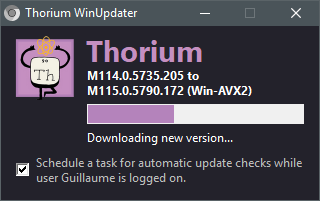

# Thorium WinUpdater
by ltGuillaume: [Codeberg](https://codeberg.org/ltGuillaume) | [GitHub](https://github.com/ltGuillaume) | [Buy me a beer](https://buymeacoff.ee/ltGuillaume) 🍺

An attempt to make updating [Thorium for Windows](https://github.com/Alex313031/Thorium-Win-AVX2) much easier. This is a fork of [LibreWolf WinUpdater](https://codeberg.org/ltGuillaume/librewolf-winupdater).



## Getting started
- If you want to run the portable version of Thorium, download and extract [`Thorium_AVX2_xxx.x.xxxx.x.zip`](https://github.com/Alex313031/Thorium-Win-AVX2/releases). Put `Thorium-WinUpdater.exe` in the same folder.  
  Then, if you wish to perform an update, just run `Thorium-WinUpdater.exe`.
- When you have installed Thorium using the [Thorium_AVX2_mini_installer.exe](https://github.com/Alex313031/Thorium-Win-AVX2/releases), just run `Thorium-WinUpdater.exe` from any place you like to check for updates. If one is available, it will be downloaded immediately.

## Scheduled updates
- Run Thorium WinUpdater and select the option to automatically check for updates. This will prompt for administrator permissions and a blue (PowerShell) window will notify you of the result. The scheduled task will run while the current user account is logged on (at start-up and every 24 hours).
- If your account has administrator permissions, the update will be fully automatic. If not, the update will be downloaded and you will be asked by WinUpdater to start the update.  
- If Thorium is already running, the updater will notify you of the new version. The update will start as soon as you close the browser.

## Remarks
- The updater needs to be able to write to `Thorium-WinUpdater.ini` in its own folder, (so make sure it has permission to do so), otherwise WinUpdater will copy itself to `%LocalAppData%\Thorium\WinUpdater` and run from there.
- `Thorium-WinUpdater.ini` contains a `[Log]` section that shows the results of the last update check and update action.
- Thorium WinUpdater also updates itself automatically, so you won't have to check for new releases here. If you prefer to update WinUpdater yourself, add the following to the .ini file:
  ```ini
  [Settings]
  UpdateSelf=0
  ```
- Thorium by default downloads the AVX2 build. You can change the build to `Win` or `Win7` by adding the following to the .ini file:
  ```ini
  [Settings]
  Build=Win7
  ```
  _Obviously, don't add the line `[Settings]` twice_.


## Credits
* [Thorium](https://thorium.rocks) by [Alex Frick](https://github.com/Alex313031)
* The Chromium Project
* Original icon by the [Alex Frick](https://github.com/Alex313031/thorium/blob/main/logos/NEW/win/thorium.ico)
* Original logo by the [Alex Frick](https://github.com/Alex313031/thorium/blob/main/logos/STAGING/Thorium90_252.jpg)
